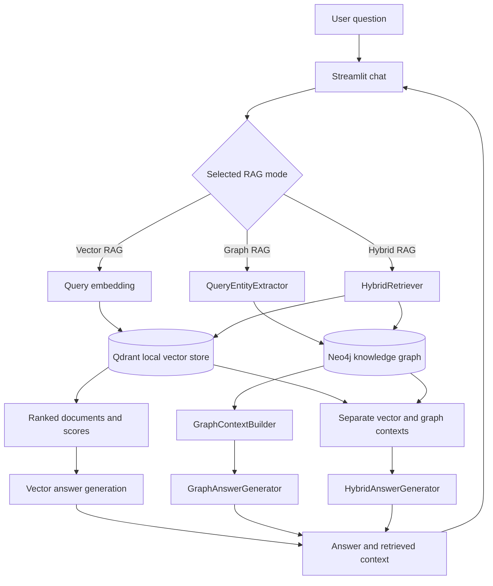
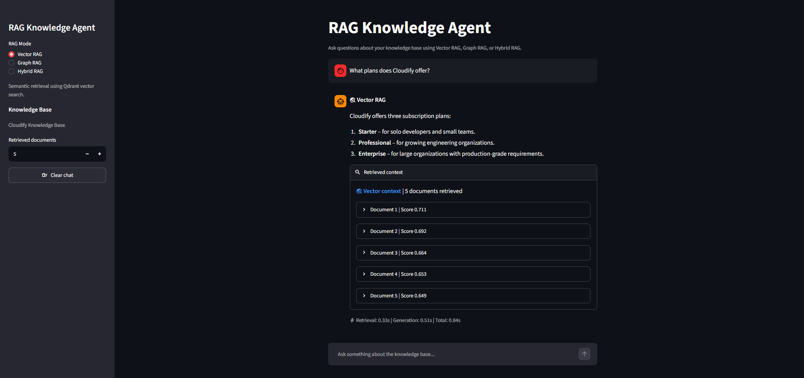
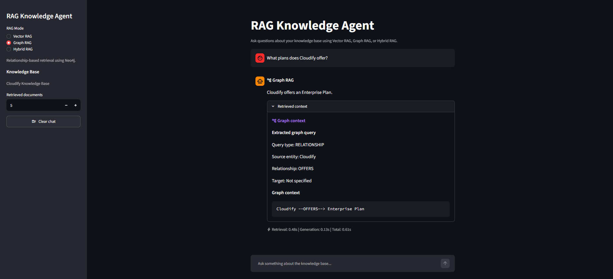
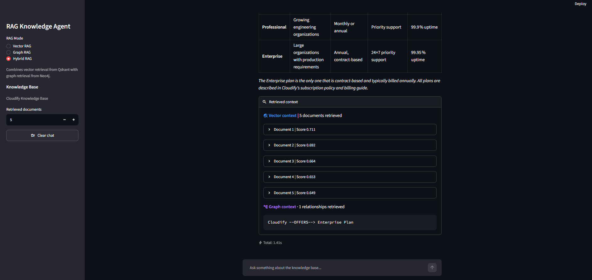

# RAG Knowledge Agent

A Python retrieval-augmented generation project for Cloudify, a fictional SaaS knowledge base. It implements Vector RAG with Qdrant, manual GraphRAG with Neo4j, a Hybrid RAG pipeline, a separate GraphCypherQAChain example, and a RAGAS evaluation workflow. An interactive Streamlit chat lets users select Vector, Graph, or Hybrid RAG for each question.

## Features

- **Vector RAG:** semantic search over embedded Cloudify documents using Qdrant.
- **Manual GraphRAG:** LLM-based entity and relationship extraction, query intent extraction, Neo4j retrieval, and graph-grounded answer generation.
- **Hybrid GraphRAG:** retrieves vector documents and graph results for the same question, keeps the contexts separate, and generates an answer from both.
- **GraphCypherQAChain:** a separate schema-aware natural-language-to-Cypher example with few-shot instructions.
- **Provider interfaces:** configured OpenAI, Groq, and Cohere provider implementations.
- **Interactive Streamlit app:** chat interface with a per-response RAG mode label, answer, retrieval evidence, and available timings.
- **RAGAS evaluation:** separate reference-based evaluation for Faithfulness, Context Precision, Context Recall, and Answer Relevancy.
- **Cloudify corpus:** fictional policy and product documents in `data/documents/`.

## Architecture



The presentation layer dispatches to the existing pipeline components; it does not implement a second retrieval algorithm. The Vector and Hybrid paths use the shared `RetrievalController`. Manual GraphRAG and Hybrid share the graph query extractor and `GraphRetriever`. The Streamlit chat does not add conversational memory to the RAG calls: each request sends the current question to its selected pipeline. Conversation history is kept in the browser session.

### Document and graph preparation

`IngestionController` reads Markdown documents, applies the configured chunker, creates Cohere (or configured provider) embeddings, and writes text and metadata to the local Qdrant store under the `cloudify_documents` collection. The graph builder reads document chunks, calls the configured provider's `LLMGraphTransformer` integration, and persists graph documents to Neo4j. The graph must be populated before Graph RAG or Hybrid RAG can retrieve useful relationships.

## Vector RAG

Vector RAG represents document chunks and the user's question as embeddings. The existing `RAGPipeline` retrieves documents from Qdrant, filters by the configured similarity threshold, builds a context prompt, and asks the configured generation provider for a grounded answer.

```text
Question -> query embedding -> Qdrant similarity search -> top-k documents
         -> context prompt -> LLM -> answer
```

Semantic search is useful when the question and source passage use different wording but discuss the same subject. The UI shows the number of retrieved documents, each available similarity score, document text, and metadata where the retrieval model exposes it.

### Vector RAG

**Vector RAG — Qdrant semantic retrieval**



The screenshot demonstrates a Vector RAG question and answer, Qdrant-retrieved documents and similarity scores, and measured retrieval and generation timing when available.

## GraphRAG

GraphRAG represents extracted entities as nodes and their relationships as edges. `GraphExtractor` uses the configured LLM provider's `LLMGraphTransformer` implementation to extract graph documents. `Neo4jGraphBuilder` persists those graph documents in Neo4j. At query time, `QueryEntityExtractor` produces a structured `GraphQuery`; `GraphRetriever` selects entity or relationship retrieval based on that query; `GraphContextBuilder` formats relationships such as `Cloudify --OFFERS--> Enterprise Plan`; and `GraphAnswerGenerator` grounds the response in that context.

```text
Markdown documents -> chunks -> LLMGraphTransformer -> entities and relationships
                    -> Neo4j
Question -> QueryEntityExtractor -> GraphRetriever -> graph context
          -> GraphAnswerGenerator -> answer
```

Graph retrieval is useful for entity-centered and relationship questions where explicit connections matter. The interactive app uses this **manual GraphRAG pipeline**. It can display the extracted query fields when exposed, followed by the graph relationships returned by Neo4j.

### Graph RAG

**Graph RAG — Neo4j relationship-based retrieval**



The screenshot demonstrates Graph RAG mode, the extracted query (when available), and Neo4j graph context such as `Cloudify --OFFERS--> Enterprise Plan`.

## GraphCypherQAChain

The repository also contains `GraphCypherQA`, which uses LangChain's `GraphCypherQAChain` to translate a natural-language question into a read-only Cypher query, run it against Neo4j, and formulate an answer from the query result. Its schema-aware prompt includes few-shot question/query examples, for example:

**Question:** What plans does Cloudify offer?

```cypher
MATCH (c {id: "Cloudify"})-[:OFFERS]->(p)
RETURN p.id
```

The schema instructions constrain generated queries to known labels, relationships, and properties; examples demonstrate the project's graph schema and query shape. This is a separate GraphRAG approach in the codebase and is **not** the manual Graph RAG path used by the current Streamlit selector.

## Hybrid GraphRAG

Hybrid RAG calls vector and graph retrieval for the same question. `HybridRetriever` coordinates Qdrant document retrieval with query extraction and Neo4j graph retrieval. `HybridContextBuilder` formats the vector and graph evidence separately. `HybridAnswerGenerator` receives both contexts and generates a single grounded answer.

```text
                         +-> Qdrant -> vector document context -+
Question -> HybridRetriever                                 +-> Hybrid context -> LLM -> answer
                         +-> query extraction -> Neo4j -> graph context -+
```

Vector search is strong for semantic similarity and descriptive document passages. Graph search is strong for structured entity connections and relationships. Hybrid RAG uses both evidence types and the UI labels the two contexts separately so their sources remain clear.

### Hybrid RAG

**Hybrid RAG — Qdrant + Neo4j retrieval**



The screenshot demonstrates a Hybrid RAG answer, Qdrant documents and scores, and Neo4j relationships such as `Cloudify --OFFERS--> Enterprise Plan`.

## RAG strategy comparison

| Feature | Vector RAG | Graph RAG | Hybrid RAG |
|---|---|---|---|
| Vector search | Yes | No | Yes |
| Graph search | No | Yes | Yes |
| Qdrant | Yes | No | Yes |
| Neo4j | No | Yes | Yes |
| Semantic document retrieval | Strong | Not used by this path | Strong |
| Relationship retrieval | Limited to retrieved text | Strong | Strong |
| Structured graph context | No | Yes | Yes |

## Streamlit application

The Streamlit chat is the interactive RAG demo, separate from the evaluation workflow. Select **Vector RAG**, **Graph RAG**, or **Hybrid RAG** in the sidebar, ask a question, and inspect the answer and expandable retrieved context. Each assistant message retains the mode used to generate it, even if the sidebar selection changes later. The app displays document scores and metadata when available, graph query details when exposed by the pipeline, and measured timings supported by that pipeline. Clear chat resets session history without changing either knowledge store.

## RAGAS evaluation

RAGAS evaluation is a separate command-line workflow; its metrics do not appear in the interactive chat. It evaluates the Vector, Graph, and Hybrid outputs against the reference questions and answers in `src/evaluation/datasets/rag_eval_dataset.py`.

- **Faithfulness:** whether the answer is supported by retrieved context.
- **Context Precision:** whether relevant retrieved context is ranked ahead of irrelevant context.
- **Context Recall:** whether retrieved context contains the information required by the reference answer.
- **Answer Relevancy:** whether the response addresses the user's question.

Evaluation summaries, samples, pipeline outputs, and resumable progress are written separately under `src/evaluation/results/`. Run evaluation with:

```bash
PYTHONPATH=src uv run python -m evaluation.evaluation_runner
```

## Project structure

```text
.
├── data/
│   ├── documents/                 # Fictional Cloudify policy and product corpus
│   └── README.md                  # Corpus overview
├── docker/
│   └── docker-compose.yml          # Neo4j service
├── docs/images/                   # Vector, Graph, and Hybrid RAG screenshots
├── src/
│   ├── app/                       # Interactive RAG UI and supporting components
│   ├── controllers/
│   │   ├── GraphRag/              # Graph extraction, retrieval, QA, and Neo4j builder
│   │   ├── HybridRag/             # Hybrid retrieval, context, and answer pipeline
│   │   ├── chunking/              # Recursive, token, and semantic chunkers
│   │   ├── ingestion/             # Document ingestion orchestration
│   │   ├── rag/                   # Vector RAG pipeline
│   │   └── retrieval/             # Qdrant retrieval controller
│   ├── evaluation/                # Dataset, RAGAS evaluator, runner, saved outputs
│   ├── helpers/                   # Settings and configuration
│   ├── models/                    # Document, graph, and query data models
│   ├── stores/                    # LLM and vector database providers
│   └── tests/                     # Unit and integration tests
├── .env.example                  # Environment variable template
├── pyproject.toml                # Project and dependency configuration
├── run_streamlit.sh              # Optional WSL/Linux launcher
├── test_streamlit_app.sh         # Streamlit UI smoke test
└── uv.lock                       # Locked dependency versions
```

## Technology stack

| Technology | Purpose |
|---|---|
| Python | Application and pipeline implementation |
| LangChain | LLM integrations, graph transformation, and GraphCypherQAChain |
| Qdrant | Local persistent vector storage and similarity search |
| Neo4j | Knowledge graph storage and graph retrieval |
| Groq, Cohere, OpenAI | Configurable generation, graph extraction, and embedding providers |
| Pydantic Settings | Environment-based application configuration |
| Streamlit | Interactive RAG chat and evaluation presentation components |
| RAGAS | RAG answer and retrieval evaluation |
| Docker Compose | Local Neo4j service |
| uv | Python environment and dependency management |

## Setup

### Requirements

- Python 3.12
- [uv](https://docs.astral.sh/uv/)
- Docker Engine or Docker Desktop for Neo4j
- API credentials and model IDs for the selected generation and embedding providers

Clone the repository and install the locked dependencies:

```bash
git clone https://github.com/ahmedokasha74/rag-knowledge-agent.git
cd rag-knowledge-agent
uv sync
cp .env.example .env
```

Edit `.env` with valid provider keys and model IDs. The default configuration uses Groq for generation and graph extraction, Cohere for embeddings, a local Qdrant store, and Neo4j at `bolt://localhost:7687`.

Start Neo4j:

```bash
docker compose -f docker/docker-compose.yml up -d neo4j
```

### Configure and populate the knowledge stores

Populate the local Qdrant `cloudify_documents` collection from the included Markdown corpus (the command resets/recreates that collection):

```bash
PYTHONPATH=src uv run python -c 'import asyncio; from controllers.ingestion.IngestionController import IngestionController; from helpers.config import get_settings; asyncio.run(IngestionController(get_settings()).ingest_directory("data/documents", "cloudify_documents", do_reset=True))'
```

To extract and persist the full graph to Neo4j, use the graph builder integration test with `--max-chunks 0` (all document chunks):

```bash
PYTHONPATH=src uv run python src/tests/test_neo4j_graph_builder.py --max-chunks 0
```

This calls the configured LLM graph transformer and writes graph data to Neo4j. It can take time and incur model usage charges. The default test option processes only three chunks.

## Environment variables

`.env.example` lists the settings used by the application. At minimum, configure the API key and model identifiers for the selected providers:

| Variable | Purpose |
|---|---|
| `GENERATION_BACKEND` | Text answer provider: `GROQ`, `OPENAI`, or supported `COHERE` generation |
| `GENERATION_MODEL_ID` | Model ID used for answer generation |
| `GROQ_API_KEY`, `OPENAI_API_KEY`, `COHERE_API_KEY` | Credentials for the configured providers |
| `OPENAI_API_URL` | Optional OpenAI-compatible API endpoint |
| `EMBEDDING_BACKEND` | Embedding provider; Cohere is the default |
| `EMBEDDING_MODEL_ID` | Embedding model ID |
| `EMBEDDING_MODEL_SIZE` | Embedding vector dimensions; must match the selected model |
| `GRAPH_EXTRACTION_BACKEND` | Provider used for graph query extraction and graph generation |
| `GRAPH_EXTRACTION_MODEL_ID` | Optional graph model override; falls back to `GENERATION_MODEL_ID` |
| `VECTOR_DB_BACKEND` | Vector database provider; currently `QDRANT` |
| `VECTOR_DB_PATH` | Local Qdrant data directory name under `data/` |
| `VECTOR_DB_DISTANCE_METHOD` | Qdrant similarity distance method |
| `SCORE_THRESHOLD` | Minimum vector similarity score used by retrieval |
| `NEO4J_URI` | Neo4j Bolt connection URL |
| `NEO4J_USER`, `NEO4J_PASSWORD` | Neo4j credentials |
| `NEO4J_DATABASE` | Neo4j database name |

Use the key for each provider you select; do not commit `.env` or put real credentials in `.env.example`. The current Qdrant provider is local and persistent, so it does not use `QDRANT_URL` or `QDRANT_API_KEY` settings.

## Run the Streamlit app

```bash
PYTHONPATH=src uv run streamlit run src/app/streamlit_app.py
```

Open the local URL printed by Streamlit (normally `http://localhost:8501`), select a RAG mode, enter a Cloudify question, and expand **Retrieved context** to inspect the evidence used by that pipeline.

## Example questions

These questions are used by the project tests, evaluation dataset, or pipeline examples:

- **Vector RAG:** What plans does Cloudify offer?
- **Graph RAG:** What is the relationship between Cloudify and Professional?
- **Hybrid RAG:** What are the permitted uses of Cloudify?
- What is the uptime commitment for the Professional plan?
- What API request limit applies to the Professional plan?
- How does the Enterprise plan differ from Professional in uptime and support?
- What uptime does Professional promise, and what service credit applies if monthly uptime falls below 99.9%?

## Design decisions

- **Qdrant** provides persistent vector similarity search behind the project's vector database interface. The current provider stores its data locally under `data/`.
- **Neo4j** stores explicit entities and relationships for graph-shaped retrieval and Cypher queries.
- **LLM-based graph extraction** maps source chunks into graph documents, allowing the graph to be built from the existing Cloudify corpus.
- **Hybrid RAG** handles questions that benefit from both semantic passages and explicit entity relationships; keeping both context types visible also makes retrieval behavior inspectable.
- **GraphCypherQAChain** demonstrates schema-conditioned natural-language-to-Cypher as a separate approach from the manually extracted Graph RAG query path.
- **Few-shot Text-to-Cypher examples** show the expected node properties and relationships and guide the model toward the actual graph schema.
- **Separate evaluation and chat flows** keep RAGAS scoring out of the interactive answer experience while preserving repeatable reference-based evaluation.

## Future work

Potential extensions that fit the current architecture include Agentic RAG, query rewriting, reranking or Reciprocal Rank Fusion, entity resolution, richer graph traversal, conversation-aware retrieval, production monitoring, broader evaluation, and an MCP integration. These are roadmap items; they are not claims about current behavior.

Run the Streamlit UI smoke check with `bash test_streamlit_app.sh`. It verifies that the app renders and exposes its chat input and three RAG mode choices without contacting the model or databases.
